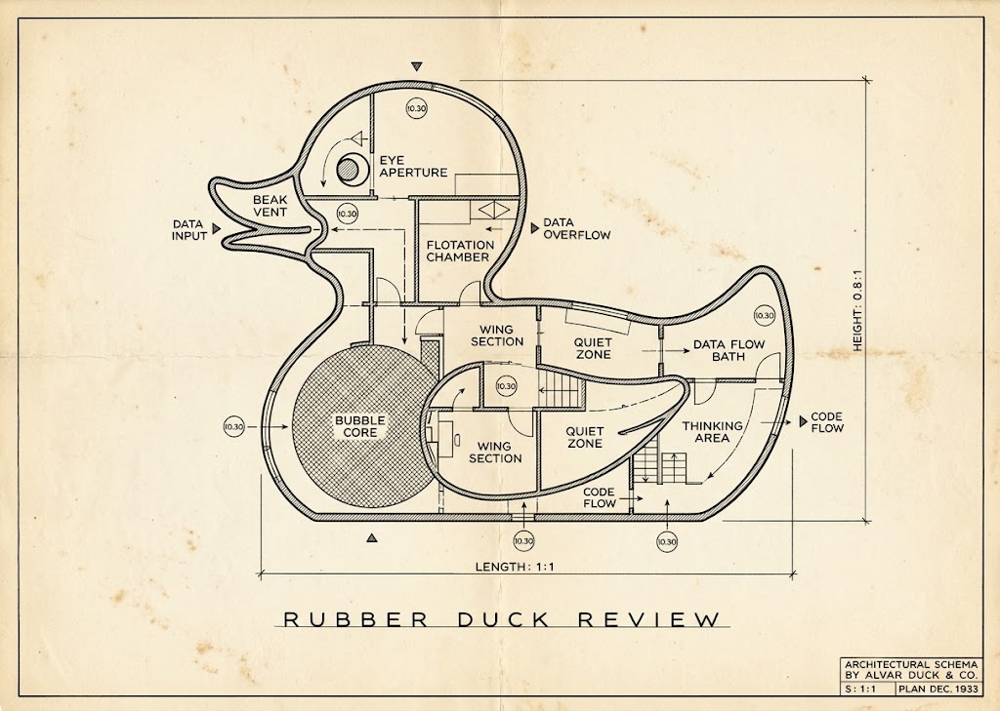

Rubber Duck Review is a VS Code extension for local code reviews. Write inline comments on your source files, stored as JSON in your workspace, see [`reviews-schema.json`](./reviews-schema.json).

The extension supports line and file-level comments and Markdown export that can be given to an LLM agent as input.

## Usage

Run **Rubber Duck: Start Review** from the Command Palette, or click "Start Review" in the status bar.

Once active:
- Click `+` icons in the editor gutter to add line comments. Drag across lines to comment on a range.
- Click **Add Suggestion** in the editor title bar or run **Rubber Duck: Add Suggestion** to insert a pre-filled comment with a code `suggestion` markdown block for the selected text.
- Comments can also be added in the git diff view (SCM panel) on the modified side.

Export comments with **Rubber Duck: Export Review as Markdown**. Here is an example of the exported Markdown:

````markdown
# Code Review: rubber-duck-review

**Author:** Tero Saarni <tero.saarni@gmail.com>
**Date:** 2026-07-20 14:16:56 UTC
**Base:** `1c5d56d` ("update")
**Head:** `1c5d56d` ("update" (with uncommitted changes))

> **Note:** Line numbers may differ from the current file.

---

## src/extension.ts:181 @@ updateStatusBar
<!-- comment id a90328bd-cdf4-46b0-a120-3bec2e5665d1, created at 2026-07-20T14:20:27.942Z -->

```typescript
    statusBarItem.text = '$(comment-discussion) Start Review';
```

Tero Saarni wrote:
> This should have duck icon instead of comment-discussion (speech bubble).
````

### Configuration

| Setting | Default | Description |
|---|---|---|
| `rubberDuck.reviewsFilePath` | `.vscode/reviews.json` | Reviews file path, relative to workspace root. |

## Installation

Check out the repo and install into VS Code:

```bash
git clone https://github.com/tsaarni/rubber-duck-review.git
cd rubber-duck-review
pnpm install
pnpm run install-extension
```

Or manually package and install:

```bash
pnpm run package
code --install-extension rubber-duck-review.vsix --force
```

Or open the Extensions view in VS Code, click `...` at the top, and select **Install from VSIX...**.

## Development

Press `F5` in VS Code to launch a debug window with the extension loaded.

| Command | Description |
|---|---|
| `pnpm run compile` | Compile TypeScript. |
| `pnpm run watch` | Compile and watch for changes. |
| `pnpm run package` | Package the extension into `rubber-duck-review.vsix`. |
| `pnpm run install-extension` | Compile, package, and install the extension into VS Code. |
| `pnpm run check` | Check for lint and format issues using Biome. |
| `pnpm run format` | Auto-fix lint and format issues using Biome. |
