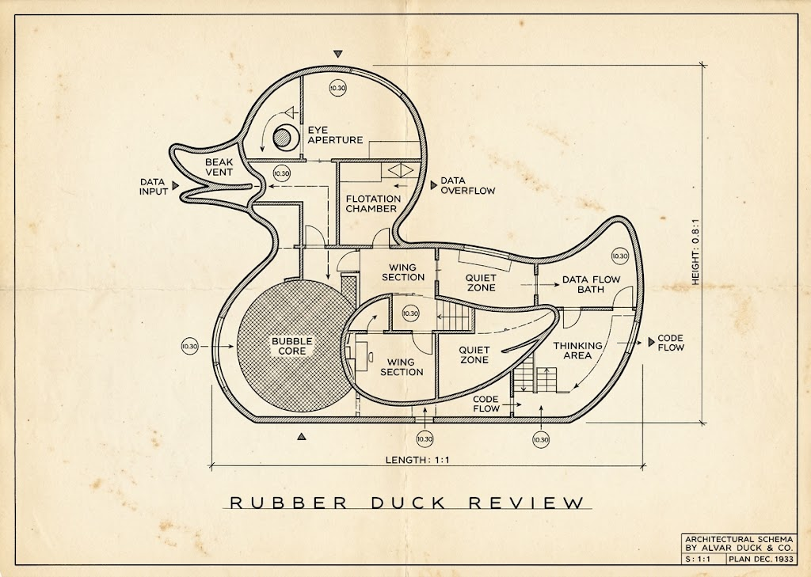

Rubber Duck Review is a VS Code extension for local code reviews. Write inline comments on your source files, stored as JSON in your workspace, see [`reviews-schema.json`](./reviews-schema.json).

The extension supports line and file-level comments and Markdown export that can be given to an LLM agent as input.

## Usage

Run **Rubber Duck: Start Review** from the Command Palette, or click the  icon in the status bar.

Once active:
- Click `+` icons in the editor gutter to add line comments. Drag across lines to comment on a range.
- Right-click a file in the Explorer / **Rubber Duck: Add File Comment** for file-level comments.
- Run **Rubber Duck: Add Suggestion** to insert a pre-filled comment with a code `suggestion` markdown block for the selected text.
- Comments can also be added in the git diff view (SCM panel) on the modified side.
- The  icon shows the live comment count. Click it to stop the review.

Export comments with **Rubber Duck: Export Review as Markdown**. Here is an example of the exported Markdown:

````markdown
# Code Review: rubber-duck-review

**Date:** 2026-07-20 14:16:56 UTC
**Base:** `1c5d56d` ("update")
**Head:** `1c5d56d` ("update" (with uncommitted changes))

> **Note:** Line numbers may differ from the current file.

---

## src/extension.ts:181 @@ updateStatusBar
<!-- comment id a90328bd-cdf4-46b0-a120-3bec2e5665d1, created at 2026-07-20T14:20:27.942Z -->

```typescript
    statusBarItem.text = '$(comment-discussion) Start Review';
```

Reviewer wrote:
> This should have duck icon instead of comment-discussion (speech bubble).
````

### Commands

| Command | Description |
|---|---|
| Rubber Duck: Start Review | Start or resume a review, auto-resumes if one matches the current commit |
| Rubber Duck: New Review | Always create a fresh review |
| Rubber Duck: Switch Review | Load a previously saved review |
| Rubber Duck: Stop Review | Hide annotations (comments preserved on disk) |
| Rubber Duck: Clear Current Review | Delete the active review |
| Rubber Duck: Delete All Reviews | Delete all reviews for this workspace folder |
| Rubber Duck: Export Review as Markdown | Export to a `.md` file |

### Configuration

| Setting | Default | Description |
|---|---|---|
| `rubberDuck.reviewsFilePath` | `.vscode/reviews.json` | Reviews file path, relative to workspace root. |

## Installation

This extension is mainly for personal use. If you want to use it, you can install it from the latest GitHub release.

```bash
curl -fsSL -o rubber-duck-review.vsix https://github.com/tsaarni/rubber-duck-review/releases/latest/download/rubber-duck-review.vsix
code --install-extension rubber-duck-review.vsix
```

Or see [`CONTRIBUTING.md`](./CONTRIBUTING.md) for instructions on building and installing the extension locally from source.
